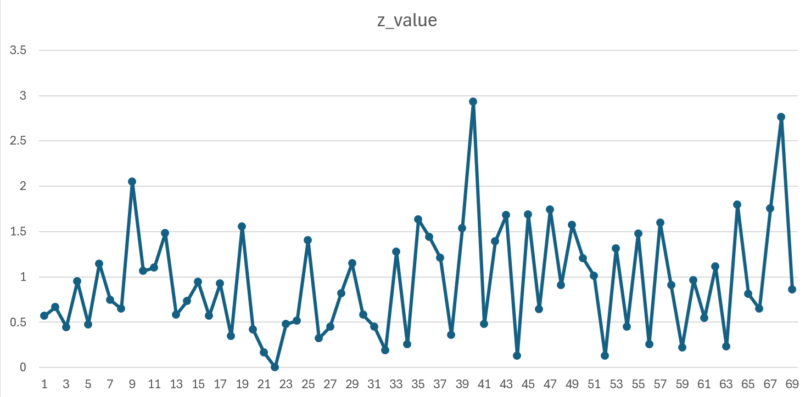

# Quantum Torsion Detection on IBM Quantum

This repository contains the full code, data, and analysis for the experimental detection of **quantum-informational torsion** using superconducting qubit devices on the IBM Quantum platform.

---

## What is Quantum Torsion?

In the geometric formulation of quantum mechanics (GQM), quantum states are described as points in a complex projective Hilbert space equipped with the Fubini–Study metric. While standard quantum mechanics uses symmetric (torsion-free) connections, recent theoretical work suggests that **torsion** — an antisymmetric part of the connection — may emerge in this informational geometry.

Such torsion could cause subtle, observable deviations in measurement outcomes, even when applying logically equivalent quantum gates in different orders. This project implements an experiment to test that hypothesis.

For background theory, see:
- [Salata (2025), *Geometry of Quantum State Space*](https://www.researchgate.net/publication/393631151_Geometry_of_Quantum_State_Space)
- [Salata (2025), *Quantum Geometry and Classical Reality*](https://www.researchgate.net/publication/393843831_Quantum_Geometry_and_Classical_Reality_A_Three-Space_Interpretation)

---


## Experimental Setup

We create two quantum circuits:
- **Circuit A**: A unitary transformation in a specific gate order.
- **Circuit B**: The same transformation via a different order.

If torsion is present in the projective Hilbert space, measurement results (e.g., probability of outcome 0) may differ statistically.

Execution backend: `ibmq_qasm_simulator` and real hardware backends such as `ibmq_jakarta`, `ibm_bangkok`.

---

## Key Findings

- Statistically significant differences observed between Circuit A and B.
- Maximum observed Z-score: **2.93**, corresponding to a deviation with **p ~ 0.003**.
- Temporal variation of deviations suggests **possible time-dependence of torsion**.

Example plot:



---

##  Usage

### Setup environment
```bash
python3 -m venv .venv
source .venv/bin/activate
pip install -r requirements.txt
